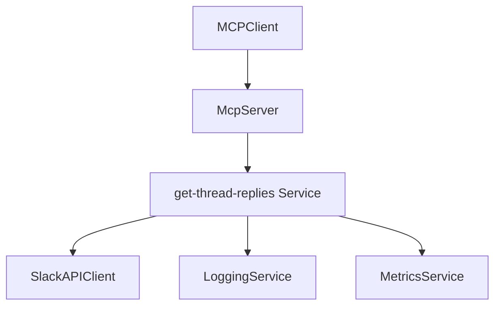
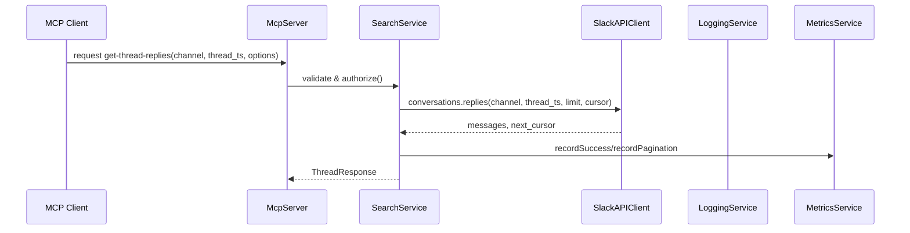

# Design: get-thread-replies

## 概要

この機能は、Slack のスレッド（親メッセージとその返信群）を MCP クライアントが一貫性を持って取得できるようにするものです。ターゲットは MCP を用いる AI エージェントやツールで、スレッド単位の文脈取得を容易にします。

### Goals

- 親メッセージと全返信を一貫したスキーマで返す（メタデータ含む）
- ページネーション、順序オプション、編集/削除の明示をサポートする
- 認証・権限チェックとレート制限ハンドリングを実装し、可観測性を提供する

### Non-Goals

- メッセージ本文の全文検索やインデックス作成（別機能）
- UI レンダリングやクライアント側の表示ロジック

---

## アーキテクチャ

### 既存アーキテクチャとの整合性

- 本機能は既存の `SearchService` の拡張として実装し、`SlackAPIClient`、`LoggingService`、`MetricsService` と連携します。
- MCP ツールは `McpServer` に登録され、工具ハンドラーから `SearchService.getThreadReplies()` を呼び出します。

### アーキテクチャ図



#### 選択理由

- 既存のサービス層を再利用することで境界とテストカバレッジを保ちつつ、最小限の変更で機能追加が可能です。
- すべての外部呼び出しは `SlackAPIClient` を通すことでレート制限・リトライ戦略を統一します。

---

## システムフロー

### シーケンス（要約）



- リトライは `SlackAPIClient` レイヤで指数バックオフ（maxRetries=3）により行う。認証エラーはリトライしない。
- レート制限（HTTP 429）は検出次第 Metric を記録し、クライアントに速やかにエラーを返す（可観測性重視）。

---

## Requirements Traceability

| Requirement | Summary                     | Components                                    | Interfaces                     | Flows    |
| ----------- | --------------------------- | --------------------------------------------- | ------------------------------ | -------- |
| 1.1         | 親メッセージと全返信を返す  | SearchService, SlackAPIClient                 | SearchService.getThreadReplies | Sequence |
| 1.2         | NotFound エラー             | SearchService                                 | Error Envelope                 | -        |
| 1.3         | レート制限ハンドリング      | SearchService, MetricsService, SlackAPIClient | Metrics, Errors                | -        |
| 1.4         | ページネーション対応        | SearchService, SlackAPIClient                 | Pagination tokens              | Sequence |
| 2.1/2.2     | 順序指定（古い順/新しい順） | SearchService                                 | Options param                  | -        |
| 2.3/2.4     | 編集/削除の扱い             | SearchService                                 | Message Metadata               | -        |
| 3.1/3.2/3.3 | 認証・権限                  | McpServer, SearchService                      | Auth Errors                    | -        |
| 4.1/4.2/4.3 | パフォーマンス・可観測性    | SearchService, MetricsService, LoggingService | Metrics/Logs                   | -        |

---

## Components and Interfaces

### SearchService (Domain: Backend / Service)

| Field        | Detail                                                                     |
| ------------ | -------------------------------------------------------------------------- |
| Intent       | MCP の `get-thread-replies` 要求を実行し、整形された ThreadResponse を返す |
| Requirements | 1.1, 1.2, 1.3, 1.4, 2.1-2.4, 3.1-3.3, 4.1-4.3                              |

**Service Interface**

```typescript
interface SearchService {
  getThreadReplies(input: GetThreadRepliesRequest): Promise<GetThreadRepliesResponse>
}
```

**Types (概要)**

```typescript
type GetThreadRepliesRequest = {
  channelId: string
  threadTs: string
  limit?: number // ページサイズ
  cursor?: string // 継続用トークン
  order?: 'oldest' | 'newest'
  requester?: { userId?: string; token?: string }
}

type Message = {
  ts: string
  user?: string
  text?: string | null // 削除/非公開時は null
  edited?: boolean
  deleted?: boolean
  subtype?: string | null
}

type GetThreadRepliesResponse = {
  parent?: Message
  replies: Message[]
  nextCursor?: string | null
  hasMore?: boolean
}

interface ApiError {
  code: string // e.g., 'NotFound','AuthenticationError','AuthorizationError','RateLimit'
  message: string // 日本語メッセージ
}
```

**Preconditions**

- `channelId` と `threadTs` は存在し、形式が妥当であること。

**Postconditions**

- 成功時は `GetThreadRepliesResponse` を返す。エラー時は `ApiError` を返却する。

**Implementation Notes**

- Slack の `conversations.replies` を使用し、`limit` と `cursor` を利用してページングを実装する（`SlackAPIClient` が具体的な呼び出しを行う）。
- スレッド内の削除メッセージは `deleted: true` として返し、本文は null にする。
- メッセージ編集は `edited: true` を付与して最新本文を返す。

---

### SlackAPIClient (Domain: External Integration)

| Intent | Slack Web API 呼び出しの抽象化とレート制限/リトライの統一 |
| Requirements | 1.1, 1.3, 1.4 |

**Contracts**

- `conversations.replies(channel, thread_ts, limit?, cursor?) -> {messages[], next_cursor}`
- エラーは標準化し、`ApiError` にマップして上位に伝播する。

**Retry & Rate-limit policy**

- 接続系/一時エラーは指数バックオフで maxRetries=3（baseDelayMs=1000）。
- HTTP 429 は `RateLimit` エラーとして伝播し、再試行は SlackAPIClient 呼び出し側の判断で行う（ここでは速やかに上位に返す設計）。

---

### LoggingService / MetricsService

- すべての失敗・成功・ページネーションイベントを記録する（日本語ログ）。
- Metrics: totalRequests, successfulRequests, failedRequests, rateLimitEvents, averageLatency

---

## Data Models

- `Message` 型（上記）を中心に、メッセージの編集・削除フラグを明示する。
- 一時的なキャッシュは現段階では採用しない（パフォーマンス観測後検討）。

---

## Error Handling

- 認証エラー (AuthenticationError): 即時エラー返却（リトライ不可）
- 権限エラー (AuthorizationError): 404 と区別できる明確な 403 系エラーを返す
- NotFound: 親メッセージ不在時に `NotFound` を返却
- RateLimit: Metric 登録後 `RateLimit` エラーを返却

---

## テスト戦略

- Unit: `SearchService.getThreadReplies` の正パス、NotFound、権限エラー、編集/削除処理、ページネーションケース
- Integration: Slack API をモックして conversations.replies のページング・レート制限を検証
- Performance: 100件の返信を想定したレスポンスタイム測定（目標: 99% が 3 秒以内）

---

## Open Questions / リスク

- 大規模スレッド（数千件）の扱い: ページング戦略とクライアント側の期待を明確化する必要がある
- Slack の実際の削除/編集フィールドの仕様に合わせたマッピングの確認（research.md を参照）

---

## Supporting References

詳細な外部 API 調査と比較は `research.md` にまとめています。
