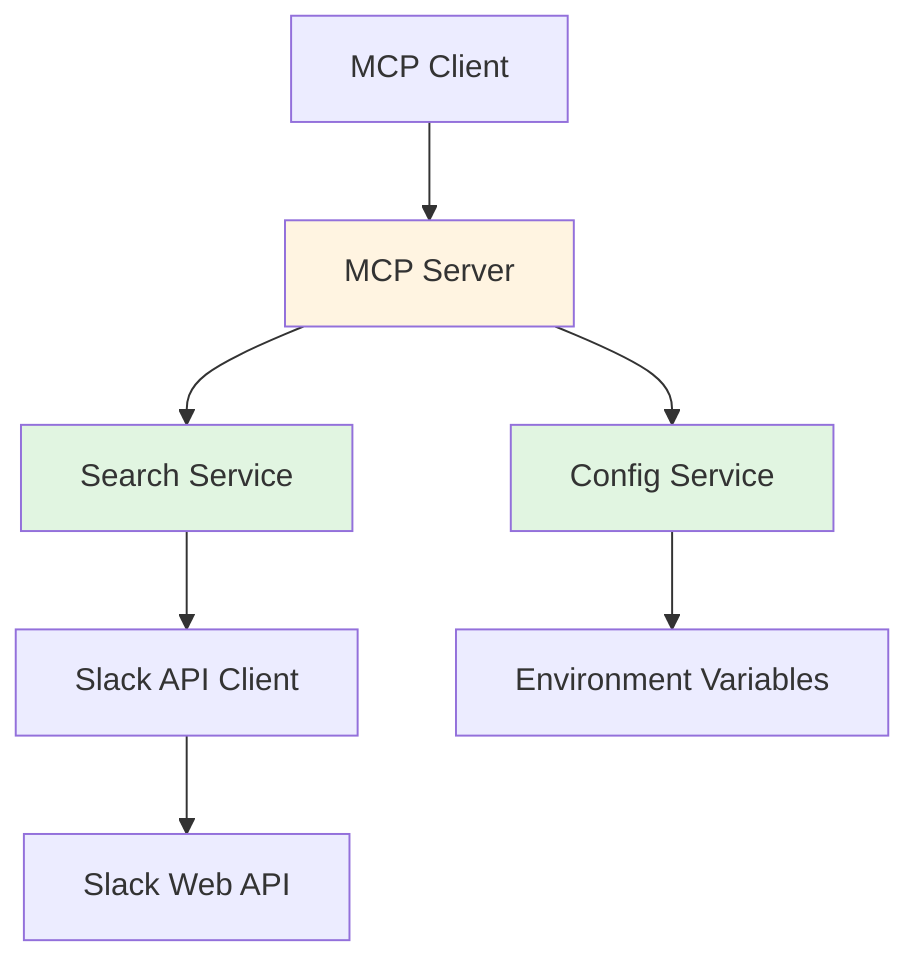
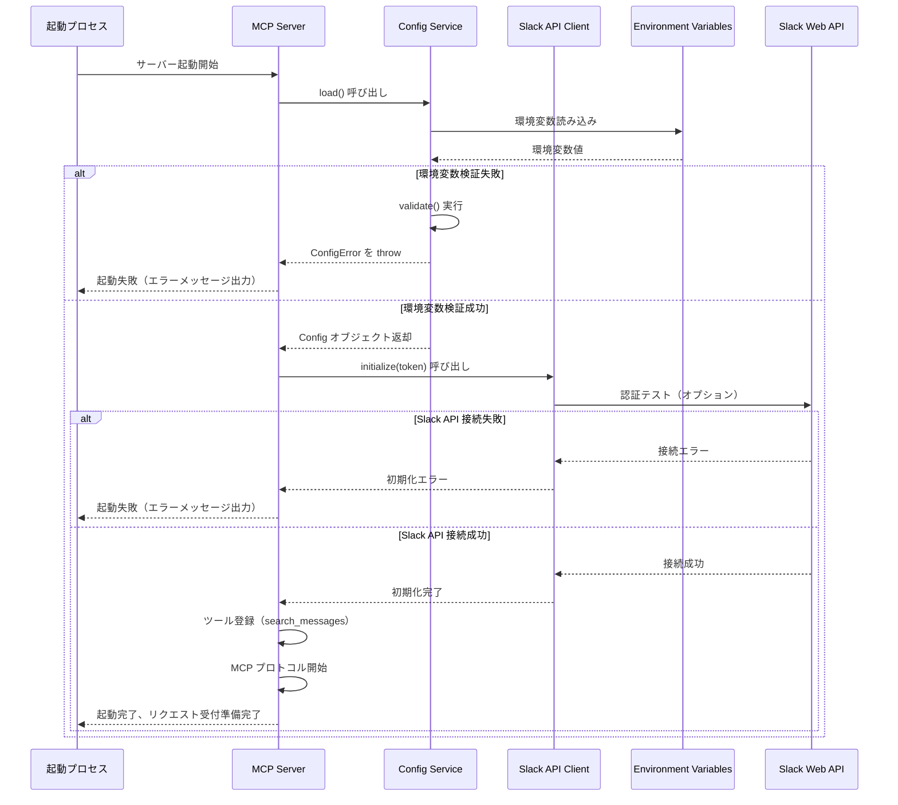
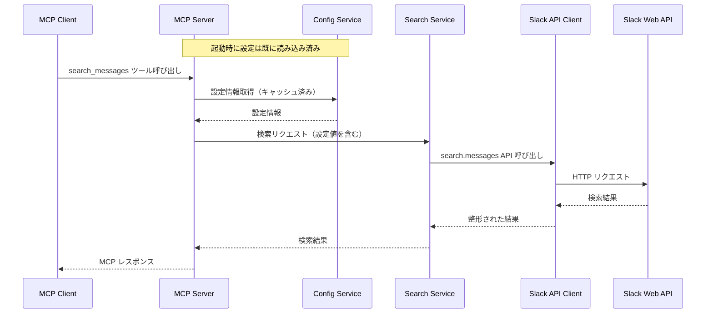

# Design Document

## Overview

本機能は、MCP (Model Context Protocol) サーバーとして Slack ワークスペース内のメッセージを検索する機能を提供します。TypeScript、Bun、Slack API を使用し、AI エージェントが Slack のメッセージを効率的に検索・取得できるようにします。本プロジェクトは大多数への公開を想定せず、`npm link` を使用したローカル開発環境での利用を想定しています。

**Users**: AI エージェント（Claude、GPT など）が MCP プロトコルを通じて Slack メッセージを検索・取得するために使用します。

**Impact**: 現在のシステムに新規機能として追加され、MCP サーバーとして動作し、Slack API との統合を提供します。

### Goals

- MCP プロトコルに準拠したサーバー実装（MCP 公式SDK使用）
- Slack Web API を使用したメッセージ検索機能（@slack/bolt使用）
- TypeScript と Bun による型安全な実装
- `npm link` によるローカル開発環境での利用
- MCP Inspector でのテスト対応

### Non-Goals

- npm パッケージとしての公開
- Web UI の提供
- メッセージ送信機能（将来の拡張として検討可能）
- リアルタイムメッセージ監視（将来の拡張として検討可能）

## Architecture

### Architecture Pattern & Boundary Map



**Architecture Integration**:

- Selected pattern: モジュール化アーキテクチャ
- Domain/feature boundaries: MCP サーバー層、検索サービス層、Slack API クライアント層、設定管理層に分離
- Existing patterns preserved: プロジェクトの既存パターンに準拠（新規機能のため既存パターンは限定的）
- New components rationale:
  - MCP Server: MCP プロトコルの実装とツール公開
  - Search Service: 検索ロジックと結果の整形
  - Slack API Client: Slack API 呼び出しとエラーハンドリング
  - Config Service: 環境変数の読み込みと検証
- Steering compliance: TypeScript による型安全性、モジュール化、設定の分離を維持

### Technology Stack

| Layer        | Choice / Version             | Role in Feature                       | Notes                     |
| ------------ | ---------------------------- | ------------------------------------- | ------------------------- |
| Language     | TypeScript ^5                | 型安全な実装                          | peer dependency           |
| Build Tool   | Bun                          | TypeScript のビルドとランタイム       | `bun build` でビルド      |
| Runtime      | Bun                          | MCP サーバーの実行環境                | TypeScript を直接実行可能 |
| Slack API    | @slack/bolt                  | Slack Web API の呼び出し              | Bolt フレームワーク       |
| MCP Protocol | @modelcontextprotocol/server | MCP プロトコルの実装                  | 公式 SDK、stdio transport |
| Testing      | MCP Inspector                | MCP サーバーのテスト                  | 公式テストツール          |

## System Flows

### 起動フロー



**起動時の処理順序**:

1. **環境変数の読み込みと検証（起動時必須）**:
   - Config Service の `load()` メソッドで環境変数を読み込み
   - Config Service の `validate()` メソッドで必須環境変数（`SLACK_USER_TOKEN`）を検証
   - 検証失敗時は起動を中止し、明確なエラーメッセージを出力

2. **Slack API Client の初期化（起動時）**:
   - Config Service から取得した `SLACK_USER_TOKEN` を使用して Slack API Client を初期化
   - 初期化時に Slack API への接続テストを実行（オプション、実装時に決定）
   - 接続失敗時は起動を中止し、エラーメッセージを出力

3. **MCP Server の初期化**:
   - ツール（`search_messages`）を登録
   - MCP プロトコルの stdio transport を開始
   - リクエスト受付準備完了

**起動時のエラーハンドリング**:

- **環境変数未設定**: Config Service の `validate()` で検出し、起動を中止。不足している環境変数名を含む明確なエラーメッセージを出力
- **Slack API 接続失敗**: Slack API Client の初期化時に検出し、起動を中止。接続エラーの詳細を含むエラーメッセージを出力
- **予期しないエラー**: すべての起動時エラーをキャッチし、適切なエラーメッセージとともに起動を中止

**Config Service の検証タイミング**:

- **起動時（必須）**: MCP Server の起動直後に Config Service の `validate()` を実行し、必須環境変数の存在を確認
- **検証内容**: `SLACK_USER_TOKEN` の存在確認（必須）、`SLACK_TEAM_ID` と `SLACK_CHANNEL_IDS` の形式検証（オプション）
- **検証失敗時の動作**: 起動を中止し、プロセスを終了。エラーメッセージには不足している環境変数名と設定方法のガイダンスを含める

### メッセージ検索フロー



**Key Decisions**:

- **起動時の初期化**: 環境変数の読み込みと検証、Slack API Client の初期化は起動時に一度だけ実行される
- **Fail Fast 原則**: 起動時に環境変数や Slack API 接続の問題を検出し、早期にエラーを報告して起動を中止
- **Config Service の検証タイミング**: 起動直後に `validate()` を実行し、必須環境変数の存在を確認。検証失敗時は起動を中止
- **Slack API Client のライフサイクル**: 起動時に一度だけ初期化され、すべてのリクエストで再利用される
- Slack API のレート制限エラー時は指数バックオフでリトライ
- 検索結果は構造化された形式で返却
- **依存関係の改善**: Search Service は Config Service に直接依存せず、MCP Server から設定値を注入される設計により、コンポーネント間の結合度を低減
- **Bun の採用**: プロジェクト標準に準拠し、Bun をランタイム・ビルドツールとして使用。TypeScript を直接実行可能で、`bun build` でビルド

## Requirements Traceability

| Requirement | Summary                                    | Components                     | Interfaces               | Flows                |
| ----------- | ------------------------------------------ | ------------------------------ | ------------------------ | -------------------- |
| 1.1         | MCP プロトコル仕様の実装                   | MCP Server                     | MCP Protocol Interface   | -                    |
| 1.2         | npm link での起動                          | MCP Server, Config Service     | -                        | 起動フロー           |
| 1.3         | メッセージ検索ツールの公開                 | MCP Server                     | Tool Interface           | メッセージ検索フロー |
| 1.4         | 無効なリクエストのエラーハンドリング       | MCP Server                     | Error Response Interface | -                    |
| 1.5         | 同時リクエストの処理                       | MCP Server                     | -                        | -                    |
| 2.1         | SLACK_USER_TOKEN による認証                | Slack API Client               | Auth Interface           | -                    |
| 2.2         | トークン未提供時のエラー                   | Config Service                 | Validation Interface     | 起動フロー           |
| 2.3         | Slack Web API エンドポイントの使用         | Slack API Client               | API Interface            | メッセージ検索フロー |
| 2.4         | Slack API エラーの処理                     | Slack API Client               | Error Handler            | メッセージ検索フロー |
| 2.5         | レート制限とリトライロジック               | Slack API Client               | Retry Logic              | メッセージ検索フロー |
| 3.1         | 検索クエリによるメッセージ検索             | Search Service                 | Search Interface         | メッセージ検索フロー |
| 3.2         | SLACK_CHANNEL_IDS による検索範囲の限定     | Search Service                 | Filter Interface               | メッセージ検索フロー |
| 3.3         | 複数チャンネルの横断検索                   | Search Service                 | Multi-Channel Search     | メッセージ検索フロー |
| 3.4         | SLACK_TEAM_ID によるワークスペーススコープ | Config Service                 | Team Scope               | -                    |
| 3.5         | 構造化された検索結果の返却                 | Search Service                 | Result Format            | メッセージ検索フロー |
| 3.6         | 空の結果セットの返却                       | Search Service                 | Result Format            | メッセージ検索フロー |
| 3.7         | テキストマッチング機能                     | Search Service                 | Text Matching            | メッセージ検索フロー |
| 4.1         | SLACK_USER_TOKEN の読み込み                | Config Service                 | Env Var Reader           | 起動フロー           |
| 4.2         | SLACK_TEAM_ID の読み込み                   | Config Service                 | Env Var Reader           | 起動フロー           |
| 4.3         | SLACK_CHANNEL_IDS の読み込み               | Config Service                 | Env Var Reader           | 起動フロー           |
| 4.4         | チャンネルID未提供時の全チャンネル検索     | Search Service                 | Default Behavior         | メッセージ検索フロー |
| 4.5         | 環境変数の検証                             | Config Service                 | Validation Interface     | 起動フロー           |
| 5.1         | TypeScript による実装                      | -                              | -                        | -                    |
| 5.2         | Bun ランタイム・ビルドツールの使用         | -                              | -                        | -                    |
| 5.3         | TypeScript のコンパイル                    | -                              | -                        | -                    |
| 5.4         | 型定義の提供                               | -                              | Type Definitions         | -                    |
| 5.5         | コンパイルエラーの処理                     | -                              | -                        | -                    |
| 5.6         | npm link でのリンク                        | -                              | -                        | -                    |
| 5.7         | リンク後の実行可能性                       | -                              | -                        | -                    |
| 5.8         | ローカル開発環境での利用                   | -                              | -                        | -                    |
| 6.1         | 認証エラーの処理                           | Slack API Client               | Error Handler            | メッセージ検索フロー |
| 6.2         | レート制限エラーのリトライ                 | Slack API Client               | Retry Logic              | メッセージ検索フロー |
| 6.3         | 無効なチャンネルIDの処理                   | Search Service                 | Error Handler            | メッセージ検索フロー |
| 6.4         | ログ記録                                   | -                              | Logging Interface        | -                    |
| 6.5         | 予期しないエラーの処理                     | MCP Server, Slack API Client   | Error Handler            | -                    |

## Components and Interfaces

| Component        | Domain/Layer         | Intent                                       | Req Coverage                                | Key Dependencies (P0/P1)                   | Contracts    |
| ---------------- | -------------------- | -------------------------------------------- | ------------------------------------------- | ------------------------------------------ | ------------ |
| MCP Server       | MCP Protocol         | MCP プロトコルの実装とツール公開             | 1.1, 1.2, 1.3, 1.4, 1.5                     | Search Service (P0), Config Service (P0)   | Service, API |
| Search Service   | Business Logic       | メッセージ検索ロジックと結果整形             | 3.1, 3.2, 3.3, 3.4, 3.5, 3.6, 3.7, 4.4, 6.3 | Slack API Client (P0)                      | Service      |
| Slack API Client | External Integration | Slack Web API の呼び出しとエラーハンドリング | 2.1, 2.3, 2.4, 2.5, 6.1, 6.2                | @slack/bolt (P0)                           | Service      |
| Config Service   | Configuration        | 環境変数の読み込みと検証                     | 2.2, 4.1, 4.2, 4.3, 4.5                     | process.env (P0)                           | Service      |

### MCP Protocol Layer

#### MCP Server

| Field             | Detail                                                               |
| ----------------- | -------------------------------------------------------------------- |
| Intent            | MCP プロトコルに準拠したサーバー実装。ツールの公開とリクエストの処理 |
| Requirements      | 1.1, 1.2, 1.3, 1.4, 1.5                                              |
| Owner / Reviewers | -                                                                    |

**Responsibilities & Constraints**

- MCP プロトコル仕様に準拠した実装
- ツール（search_messages）の公開とハンドリング
- リクエスト/レスポンスの JSON-RPC 形式への変換
- エラーハンドリングと適切なエラーレスポンスの返却
- 同時リクエストの処理
- Config Service から設定情報を取得し、Search Service に注入する責務

**Dependencies**

- Inbound: MCP Client — リクエスト受信 (P0)
- Outbound: Search Service — 検索処理の委譲（設定値を注入）(P0)
- Outbound: Config Service — 設定情報の取得 (P0)
- External: - (P0)

**Contracts**: Service [✓] / API [✓]

##### Service Interface

```typescript
// @modelcontextprotocol/server を使用
import { Server } from '@modelcontextprotocol/server/index.js'
import { StdioServerTransport } from '@modelcontextprotocol/server/stdio.js'

interface MCPServer {
  server: Server
  transport: StdioServerTransport
  start(): Promise<void>
  registerTool(name: string, description: string, handler: ToolHandler): void
}

type ToolHandler = (args: Record<string, unknown>) => Promise<unknown>
```

- Preconditions: 有効な MCP リクエスト形式
- Postconditions: 適切な MCP レスポンス形式で返却
- Invariants: MCP プロトコル仕様に準拠、MCP Inspector と互換性を保持

##### API Contract

| Method    | Endpoint | Request    | Response    | Errors                                                                                             |
| --------- | -------- | ---------- | ----------- | -------------------------------------------------------------------------------------------------- |
| Tool Call | stdio    | MCPRequest | MCPResponse | -32700 (Parse error), -32600 (Invalid Request), -32601 (Method not found), -32603 (Internal error) |

**Implementation Notes**

- Integration: @modelcontextprotocol/server の stdio transport を使用して MCP クライアントと通信
- Initialization: 起動時に以下の順序で初期化を実行：
  1. Config Service の `load()` と `validate()` を実行し、環境変数を検証
  2. Slack API Client の `initialize(token)` を実行し、Slack API への接続を確認
  3. ツール（`search_messages`）を登録
  4. MCP プロトコルの stdio transport を開始
- Validation: MCP 公式SDKによるリクエスト形式の検証とエラーハンドリング
- Dependency Injection: Config Service から設定情報を取得し、Search Service の `searchMessages` メソッドに設定値（channelIds、teamId など）を注入する責務を持つ
- Error Handling: 統一エラーハンドリング戦略に基づき、起動時エラーは起動を中止しプロセスを終了。リクエスト時エラーは適切なエラーレスポンスを返却しサーバーは継続動作
- Testing: MCP Inspector を使用してサーバーの動作をテスト可能
- Risks: MCP 公式SDKのバージョンアップに対応する必要がある可能性

### Business Logic Layer

#### Search Service

| Field             | Detail                                      |
| ----------------- | ------------------------------------------- |
| Intent            | メッセージ検索ロジックと結果の整形          |
| Requirements      | 3.1, 3.2, 3.3, 3.4, 3.5, 3.6, 3.7, 4.4, 6.3 |
| Owner / Reviewers | -                                           |

**Responsibilities & Constraints**

- 検索クエリの処理と Slack API への委譲
- チャンネルIDによる検索範囲の制限
- 複数チャンネルの横断検索
- 検索結果の整形と構造化
- 無効なチャンネルIDのエラーハンドリング

**Dependencies**

- Inbound: MCP Server — 検索リクエスト（設定値を含む）(P0)
- Outbound: Slack API Client — API 呼び出し (P0)
- External: - (P0)

**Contracts**: Service [✓]

##### Service Interface

```typescript
interface SearchService {
  searchMessages(options: SearchOptions): Promise<SearchResult>
}

interface SearchOptions {
  query: string
  channelIds?: string[]  // MCP Server から Config Service 経由で注入
  limit?: number
  teamId?: string        // MCP Server から Config Service 経由で注入
}

interface SearchResult {
  messages: Message[]
  total: number
  hasMore: boolean
}

interface Message {
  text: string
  timestamp: string
  channelId: string
  channelName?: string
  userId: string
  userName?: string
  threadTs?: string
}
```

- Preconditions: 有効な検索クエリとオプション
- Postconditions: 構造化された検索結果を返却
- Invariants: 検索結果は常に配列形式で返却（空の場合も含む）

**Implementation Notes**

- Integration: Slack API Client を呼び出して検索を実行
- Validation: チャンネルIDの検証とエラーハンドリング
- Error Handling: 統一エラーハンドリング戦略に基づき、無効なチャンネルIDは有効なチャンネルでの検索を継続（Graceful Degradation）。検索クエリが空の場合はエラーレスポンスを返却
- Dependency Injection: 設定値（channelIds、teamId など）は MCP Server から注入されるため、Config Service への直接依存は不要
- Risks: 大量の検索結果に対するページネーション処理が必要な可能性

### External Integration Layer

#### Slack API Client

| Field             | Detail                                       |
| ----------------- | -------------------------------------------- |
| Intent            | Slack Web API の呼び出しとエラーハンドリング |
| Requirements      | 2.1, 2.3, 2.4, 2.5, 6.1, 6.2                 |
| Owner / Reviewers | -                                            |

**Responsibilities & Constraints**

- Slack Web API への認証とリクエスト送信
- レート制限エラーの検出とリトライロジック
- 認証エラーの適切な処理
- API レスポンスの型安全な変換

**Dependencies**

- Inbound: Search Service — API 呼び出しリクエスト (P0)
- Outbound: @slack/bolt — Slack Bolt フレームワーク (P0)
- External: Slack Web API — メッセージ検索 (P0)

**Contracts**: Service [✓]

##### Service Interface

```typescript
// @slack/bolt を使用
import { App } from '@slack/bolt'

interface SlackAPIClient {
  app: App
  searchMessages(options: SlackSearchOptions): Promise<SlackSearchResponse>
  initialize(token: string): void
}

interface SlackSearchOptions {
  query: string
  count?: number
  page?: number
  sort?: 'score' | 'timestamp'
  highlight?: boolean
}

interface SlackSearchResponse {
  ok: boolean
  query: string
  messages: {
    total: number
    matches: SlackMessage[]
    paging?: {
      count: number
      total: number
      page: number
      pages: number
    }
  }
  error?: string
}

interface SlackMessage {
  type: string
  channel: {
    id: string
    name: string
  }
  user: string
  username?: string
  text: string
  ts: string
  permalink: string
  previous?: SlackMessage
  previous_2?: SlackMessage
  next?: SlackMessage
  next_2?: SlackMessage
}
```

- Preconditions: 有効な認証トークンと検索オプション
- Postconditions: Slack API レスポンスを型安全に返却
- Invariants: レート制限エラー時はリトライを実行

**Implementation Notes**

- Integration: @slack/bolt パッケージを使用して Bolt アプリを初期化
- Initialization: 起動時に `initialize(token)` メソッドを呼び出し、Slack API Client のインスタンスを初期化。インスタンスは起動後も再利用される
- Validation: Bolt フレームワークによる認証トークンの検証とエラーハンドリング
- Error Handling: 統一エラーハンドリング戦略に基づき、レート制限エラー時は指数バックオフによるリトライを実行。認証エラーは適切なエラーメッセージを生成。接続失敗やタイムアウトはリトライロジックを実行
- API Usage: `app.client.search.messages()` を使用してメッセージ検索を実行
- Lifecycle: インスタンスは起動時に一度だけ初期化され、すべてのリクエストで再利用される
- Risks: Slack API のレート制限とバージョン変更への対応が必要

### Configuration Layer

#### Config Service

| Field             | Detail                   |
| ----------------- | ------------------------ |
| Intent            | 環境変数の読み込みと検証 |
| Requirements      | 2.2, 4.1, 4.2, 4.3, 4.5  |
| Owner / Reviewers | -                        |

**Responsibilities & Constraints**

- 環境変数の読み込み
- 必須環境変数の検証
- 設定値の型変換（カンマ区切りリストなど）
- 起動時のエラーチェック

**Dependencies**

- Inbound: MCP Server — 設定情報の要求 (P0)
- Outbound: process.env — 環境変数の読み込み (P0)
- External: - (P0)

**Contracts**: Service [✓]

##### Service Interface

```typescript
interface ConfigService {
  load(): Config
  validate(): void
}

interface Config {
  slackUserToken: string
  slackTeamId?: string
  slackChannelIds?: string[]
}

interface ConfigError {
  message: string
  missingVars?: string[]
}
```

- Preconditions: 環境変数が設定されている
- Postconditions: 検証済みの設定オブジェクトを返却
- Invariants: 必須環境変数が不足している場合はエラーを投げる

**Implementation Notes**

- Integration: process.env から環境変数を読み込み
- Validation: 起動時に必須環境変数の検証を実行
- Error Handling: 統一エラーハンドリング戦略に基づき、環境変数未設定や形式エラーは起動を中止しプロセスを終了。明確なエラーメッセージとガイダンスを提供
- Risks: 環境変数の形式エラー（カンマ区切りリストなど）への対応が必要

## Data Models

### Domain Model

- **SearchQuery**: 検索クエリとオプション（チャンネルID、制限数など）
- **SearchResult**: 検索結果の集約（メッセージリスト、総数、ページング情報）
- **Message**: メッセージエンティティ（テキスト、タイムスタンプ、チャンネル、ユーザー情報）
- **Config**: 設定エンティティ（トークン、チームID、チャンネルIDリスト）

### Logical Data Model

**Structure Definition**:

- SearchQuery と SearchResult は 1:1 の関係
- SearchResult は複数の Message を含む（1:N）
- Message は単一の Channel と User に関連（N:1）

**Consistency & Integrity**:

- 検索結果は常に一貫した形式で返却
- メッセージのタイムスタンプは ISO 8601 形式
- チャンネルIDとユーザーIDは文字列形式で保持

### Data Contracts & Integration

**API Data Transfer**

- リクエスト: JSON 形式の検索オプション
- レスポンス: JSON 形式の検索結果
- バリデーション: TypeScript 型による実行時検証

**Cross-Service Data Management**

- Slack API からのレスポンスを内部形式に変換
- MCP プロトコル形式への変換

## Error Handling

### 統一エラーハンドリング戦略

すべてのコンポーネントで一貫して適用されるエラーハンドリング戦略を定義します。

#### 基本原則

1. **Fail Fast（早期失敗）**:
   - 起動時の環境変数検証と Slack API 接続確認で早期にエラーを検出し、起動を中止
   - リクエスト処理時は、無効な入力や認証エラーを即座に検出し、処理を中断

2. **Graceful Degradation（段階的機能低下）**:
   - 一部のチャンネルIDが無効な場合でも、有効なチャンネルでの検索を継続
   - 部分的な失敗があっても、可能な限り処理を継続し、部分的な結果を返却

3. **User Context（ユーザーコンテキスト）**:
   - エラーメッセージは明確で対処可能な内容を提供
   - 機密情報（トークンなど）を含まない
   - エラーの原因と解決方法のガイダンスを含める

4. **Observability（可観測性）**:
   - すべてのエラーをログに記録
   - エラーの種類、発生箇所、コンテキスト情報を含める
   - 検索リクエストの成功/失敗率を追跡

#### エラー分類と処理方針

**起動時エラー（Fatal Errors）**:
- **検出タイミング**: サーバー起動時
- **処理方針**: 起動を中止し、プロセスを終了
- **対象**: 環境変数未設定、Slack API 接続失敗、環境変数形式エラー
- **ログ**: エラーメッセージを標準エラー出力に出力

**リクエスト時エラー（Request Errors）**:
- **検出タイミング**: MCP リクエスト処理中
- **処理方針**: エラーレスポンスを返却し、サーバーは継続動作
- **対象**: 無効な MCP リクエスト形式、認証エラー、無効なチャンネルID
- **ログ**: エラーをログに記録し、MCP クライアントに適切なエラーレスポンスを返却

**外部APIエラー（External API Errors）**:
- **検出タイミング**: Slack API 呼び出し時
- **処理方針**: リトライロジックを実行し、最終的に失敗した場合はエラーレスポンスを返却
- **対象**: レート制限エラー、タイムアウト、接続失敗
- **ログ**: リトライ試行回数と最終結果をログに記録

**ビジネスロジックエラー（Business Logic Errors）**:
- **検出タイミング**: 検索処理中
- **処理方針**: 可能な限り処理を継続し、部分的な結果を返却
- **対象**: 無効なチャンネルID、空の検索クエリ
- **ログ**: 警告をログに記録し、有効な部分での処理を継続

#### コンポーネント別エラーハンドリング責務

**MCP Server**:
- MCP リクエスト形式の検証とエラーレスポンスの生成
- 起動時エラーの検出と起動中止
- 予期しないエラーのキャッチと適切なエラーレスポンスへの変換

**Config Service**:
- 環境変数の検証と検証エラーの生成
- 起動時の必須環境変数チェック

**Search Service**:
- 検索オプションの検証
- 無効なチャンネルIDの処理（有効なチャンネルでの検索を継続）
- ビジネスロジックエラーの処理

**Slack API Client**:
- Slack API 呼び出し時のエラー検出
- レート制限エラーの検出とリトライロジックの実行
- 認証エラーの検出と適切なエラーメッセージの生成

### 起動時のエラーハンドリング（Fatal Errors）

起動時に検出されたエラーは、統一エラーハンドリング戦略に基づき、起動を中止しプロセスを終了します。

**環境変数未設定エラー**:

- **検出コンポーネント**: Config Service
- **検出タイミング**: Config Service の `validate()` メソッド実行時（起動直後）
- **検証内容**: `SLACK_USER_TOKEN` の存在確認（必須）
- **処理方針**: 統一戦略に基づき、起動を中止しプロセスを終了
- **エラーメッセージ形式**: 
  ```
  エラー: 必須環境変数 SLACK_USER_TOKEN が設定されていません。
  環境変数 SLACK_USER_TOKEN を設定してください。
  ```
- **ログ**: 標準エラー出力にエラーメッセージを出力

**Slack API 接続失敗エラー**:

- **検出コンポーネント**: Slack API Client
- **検出タイミング**: Slack API Client の `initialize(token)` メソッド実行時（起動時）
- **検証内容**: Slack API への接続テスト（実装時に決定：接続テストを実行するか、最初のリクエスト時に検出するか）
- **処理方針**: 統一戦略に基づき、起動を中止しプロセスを終了
- **エラーメッセージ形式**:
  ```
  エラー: Slack API クライアントの初期化に失敗しました。
  SLACK_USER_TOKEN が有効で、必要なスコープが付与されていることを確認してください。
  ```
- **ログ**: 接続失敗の原因（認証エラー、ネットワークエラーなど）をログに記録

**環境変数形式エラー**:

- **検出コンポーネント**: Config Service
- **検出タイミング**: Config Service の `load()` メソッド実行時（起動時）
- **検証内容**: `SLACK_CHANNEL_IDS` のカンマ区切り形式の検証（オプション）
- **処理方針**: 統一戦略に基づき、起動を中止しプロセスを終了
- **エラーメッセージ形式**:
  ```
  エラー: SLACK_CHANNEL_IDS の形式が無効です。
  カンマ区切りのチャンネルIDリストを指定してください。
  例: C1234567890,C0987654321
  ```
- **ログ**: 形式エラーの詳細をログに記録

### リクエスト時エラーハンドリング（Request Errors）

リクエスト処理中に検出されたエラーは、統一エラーハンドリング戦略に基づき、適切なエラーレスポンスを返却し、サーバーは継続動作します。

**User Errors（ユーザーエラー）**:

- **Invalid Request（無効なリクエスト）**:
  - **検出コンポーネント**: MCP Server
  - **検出タイミング**: MCP リクエスト形式の検証時
  - **処理方針**: 統一戦略に基づき、MCP エラーレスポンス（-32600 Invalid Request）を返却
  - **エラーメッセージ**: リクエスト形式の説明を含む明確なエラーメッセージ
  - **ログ**: 無効なリクエスト形式をログに記録

- **Unauthorized（認証エラー）**:
  - **検出コンポーネント**: Slack API Client
  - **検出タイミング**: Slack API 呼び出し時（起動時またはリクエスト時）
  - **処理方針**: 統一戦略に基づき、MCP エラーレスポンス（-32603 Internal error）を返却
  - **エラーメッセージ**: 認証エラーメッセージとトークン設定のガイダンス
  - **ログ**: 認証エラーの詳細をログに記録（トークン情報は含めない）

- **Not Found（リソース未検出）**:
  - **検出コンポーネント**: Search Service
  - **検出タイミング**: チャンネルID検証時
  - **処理方針**: 統一戦略に基づき、有効なチャンネルでの検索を継続（Graceful Degradation）
  - **エラーメッセージ**: チャンネルIDの検証エラーメッセージ（警告として）
  - **ログ**: 無効なチャンネルIDを警告としてログに記録

**System Errors（システムエラー）**:

- **Infrastructure Failures（インフラストラクチャ障害）**:
  - **検出コンポーネント**: Slack API Client
  - **検出タイミング**: Slack API への接続失敗時
  - **処理方針**: 統一戦略に基づき、リトライロジックを実行。最終的に失敗した場合は MCP エラーレスポンスを返却
  - **ログ**: 接続失敗の詳細とリトライ試行回数をログに記録

- **Timeouts（タイムアウト）**:
  - **検出コンポーネント**: Slack API Client
  - **検出タイミング**: API リクエストのタイムアウト時
  - **処理方針**: 統一戦略に基づき、タイムアウトエラーメッセージとリトライを実行
  - **ログ**: タイムアウトの詳細をログに記録

- **Exhaustion（レート制限）**:
  - **検出コンポーネント**: Slack API Client
  - **検出タイミング**: Slack API のレート制限エラー検出時
  - **処理方針**: 統一戦略に基づき、指数バックオフによるリトライを実行
  - **ログ**: レート制限エラーの詳細とリトライ待機時間をログに記録

**Business Logic Errors（ビジネスロジックエラー）**:

- **Rule Violations（ルール違反）**:
  - **検出コンポーネント**: Search Service
  - **検出タイミング**: 検索クエリの検証時
  - **処理方針**: 統一戦略に基づき、検索クエリ必須のエラーメッセージを含む MCP エラーレスポンスを返却
  - **ログ**: ルール違反の詳細をログに記録

- **State Conflicts（状態競合）**:
  - **検出コンポーネント**: Search Service
  - **検出タイミング**: 無効なチャンネルIDが含まれる場合
  - **処理方針**: 統一戦略に基づき、有効なチャンネルでの検索を継続し、警告をログに記録（Graceful Degradation）
  - **ログ**: 無効なチャンネルIDを警告としてログに記録

### Monitoring

- エラーログの記録（認証エラー、API エラー、レート制限エラーなど）
- 検索リクエストの成功/失敗率の追跡
- Slack API のレート制限使用状況の監視

## Testing Strategy

### Unit Tests

- Config Service: 環境変数の読み込みと検証ロジック
- Search Service: 検索オプションの処理と結果の整形
- Slack API Client: API 呼び出しのモックとエラーハンドリング
- MCP Server: リクエスト/レスポンスの変換とエラーハンドリング

### Integration Tests

- MCP Server と Search Service の統合: 検索リクエストのエンドツーエンドフロー
- Search Service と Slack API Client の統合: API 呼び出しとレスポンス処理
- 環境変数の読み込みと検証の統合: 起動時の設定検証

### E2E Tests

- MCP Inspector を使用したテスト: MCP Inspector でサーバーの動作を検証
- MCP クライアントからの検索リクエスト: 実際の MCP プロトコル通信のテスト
- Slack API との統合: 実際の Slack API を使用した検索テスト（テスト用トークンを使用）

### Performance/Load

- 同時リクエストの処理: 複数の検索リクエストの同時処理
- レート制限対応: レート制限エラー時のリトライロジックの検証

## Security Considerations

- **認証トークンの管理**: 環境変数による管理と、トークンの漏洩防止
- **チャンネルアクセス制限**: 指定されたチャンネルIDのみにアクセスを制限
- **エラーメッセージ**: 機密情報（トークンなど）を含まないエラーメッセージ

## Performance & Scalability

- **検索結果の制限**: デフォルトの検索結果数を制限し、ページネーションをサポート
- **レート制限対応**: Slack API のレート制限を尊重し、リトライロジックを実装
- **キャッシュ**: 将来的な拡張として、検索結果のキャッシュを検討可能
